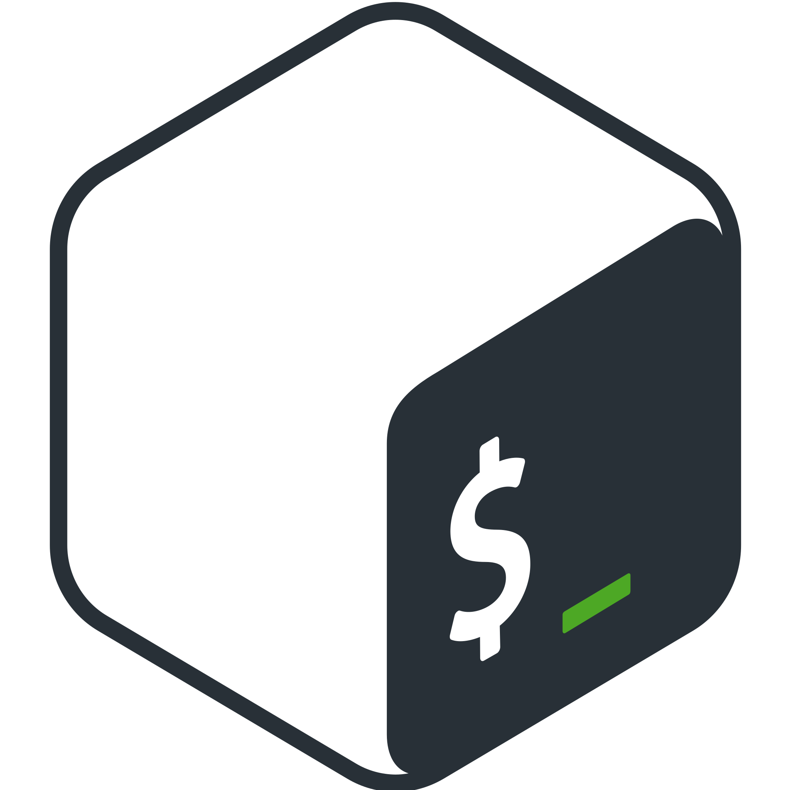
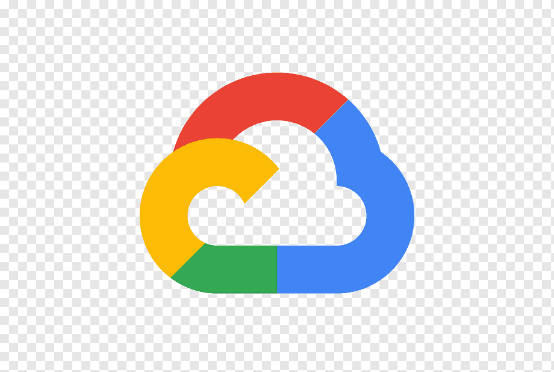

<h1 align="center">
  
</h1>

<h5 align="center">
  <code><a href="https://yusufasan.com" title="My website"> Yusuf ASAN</a></code>
  <code><a href="https://www.linkedin.com/in/yusuf-asan-046162254/" title="LinkedIn Profile"> LinkedIn</a></code>
  <code><a href="https://medium.com/@yusufasan" title="Medium Profile"> Medium</a></code>
  <code><a href="https://www.instagram.com/ysfasan/" title="Instagram Profile"> Instagram</a></code>
</h5>
 

  Hi, I'm Yusuf ASAN, VibeCoder & WebDev & MobileDev & Security AI & Cloud & Prompt Engineer from Turkey
   
   
  🔬 I'm currently student at Istanbul University - Cerrahpasa Computer Engineering
   
  🎓 I graduated from Bursa Erkek Lisesi
   
  💻 I love vibe coding / writing code and learn anythings about it
   
  📚 I’m currently learning how to build an AI agent for fixing special system vulnerabilities
   
  📫 How to reach me: <a href="mailto: ysfasan04@gmail.com">ysfasan04@gmail.com</a>

<h2 align="center">🔥 Languages & Frameworks & Tools & Abilities 🔥</h2>
 

  <code></code>
  <code></code>
  <code></code>
  <code></code>
  <code></code>
  <code></code>
  <code></code>
  <code></code>
  <code></code>
  <code></code>
  <code></code>
  <code></code>
  <code></code>
  <code></code>
  <code></code>
  <code></code>
  <code></code>
  <code></code>
  <code></code>
  <code></code>
  <code></code>
  <code></code>
  <code></code>
  <code></code>

<h2 align="center">⚡ Stats ⚡</h2>
 

  

    
    
  

           
  

    
  

   

  

<h2 align="center">👨‍💻 Repositories 👨‍💻</h2>
 

  

      

  
  

      

  
  

      

<h4 align="center">
  <a href="https://github.com/ysf-asan?tab=repositories" title="Show Repositories">🔎 Show More 🔍</a>
</h4>

<!--
**ysf-asan/ysf-asan** is a ✨ _special_ ✨ repository because its `README.md` (this file) appears on your GitHub profile.

Here are some ideas to get you started:

- 🔭 I’m currently working on ...
- 🌱 I’m currently learning ...
- 👯 I’m looking to collaborate on ...
- 🤔 I’m looking for help with ...
- 💬 Ask me about ...
- 📫 How to reach me: ...
- 😄 Pronouns: ...
- ⚡ Fun fact: ...
-->
