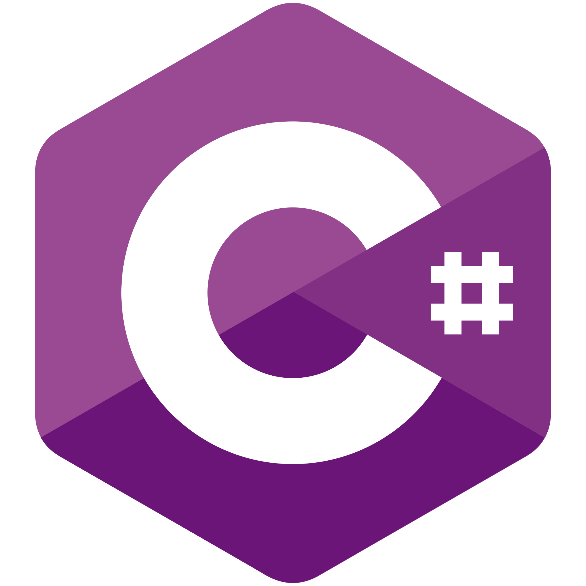
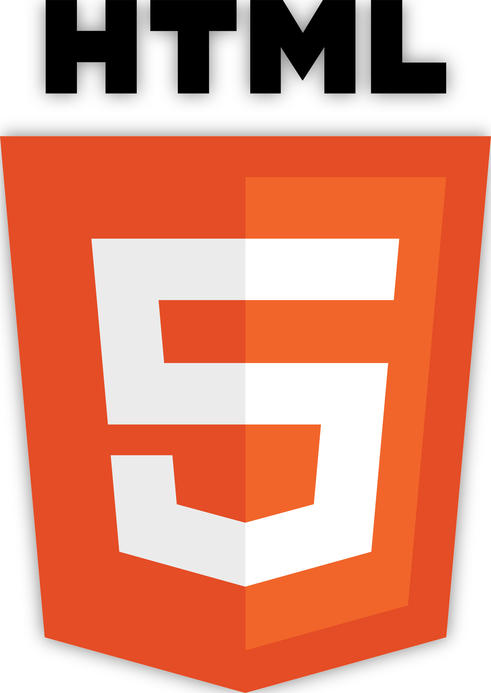
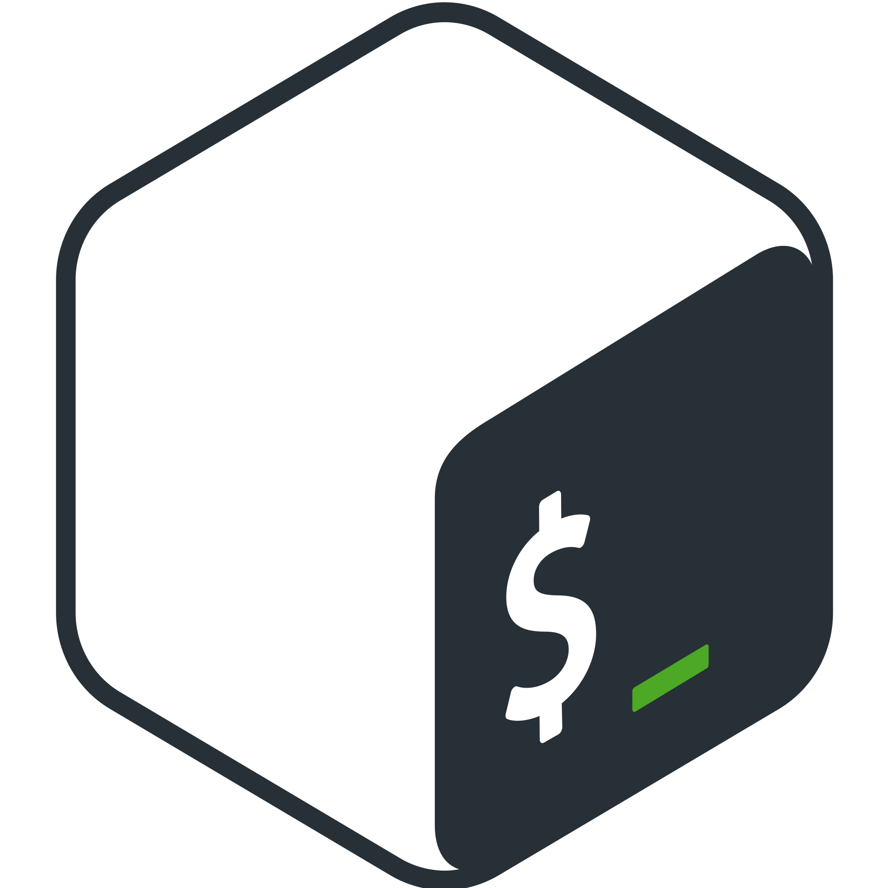
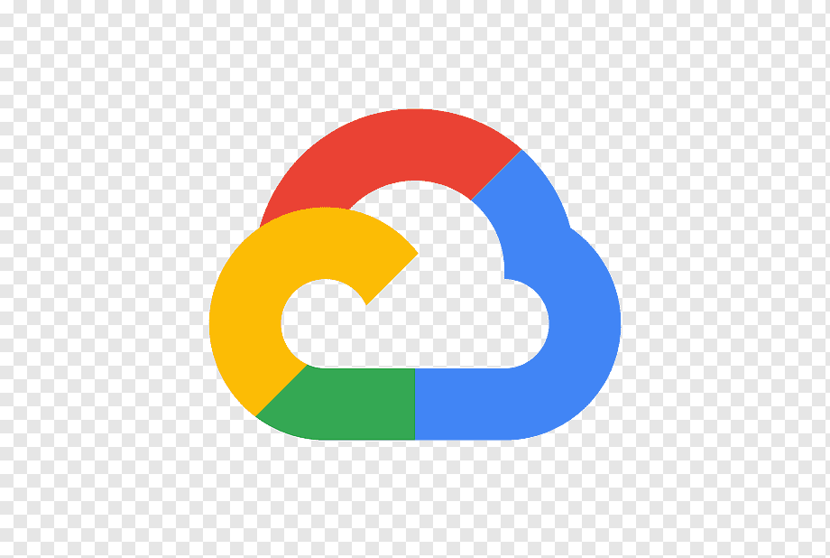

<h1 align="center">
  
</h1>

<h5 align="center">
  <code><a href="https://yusufasan.com" title="My website"> Yusuf ASAN</a></code>
  <code><a href="https://www.linkedin.com/in/yusuf-asan-046162254/" title="LinkedIn Profile"> LinkedIn</a></code>
  <code><a href="https://medium.com/@yusufasan" title="Medium Profile"> Medium</a></code>
  <code><a href="https://www.instagram.com/ysfasan/" title="Instagram Profile"> Instagram</a></code>
</h5>
 

  Hi, I'm Yusuf ASAN, AI/LLM Security & ML Engineering & Cloud & IT/Network from Turkey
   
   
  🔬 I'm currently student at Istanbul University - Cerrahpasa Computer Engineering
   
  🎓 I graduated from Bursa Erkek Lisesi
   
  💻 I love coding and learn anythings about it
   
  📚 I’m currently learning how to build an AI agent for fixing special system vulnerabilities
   
  📫 How to reach me: <a href="mailto: ysfasan04@gmail.com">ysfasan04@gmail.com</a>

<h2 align="center">🔥 Languages & Frameworks & Tools & Abilities 🔥</h2>
 

  <code></code>
  <code></code>
  <code></code>
  <code></code>
  <code></code>
  <code></code>
  <code></code>
  <code></code>
  <code></code>
  <code></code>
  <code></code>
  <code></code>
  <code></code>
  <code></code>
  <code></code>
  <code></code>
  <code></code>
  <code></code>
  <code></code>
  <code></code>
  <code></code>
  <code></code>
  <code></code>
  <code></code>

